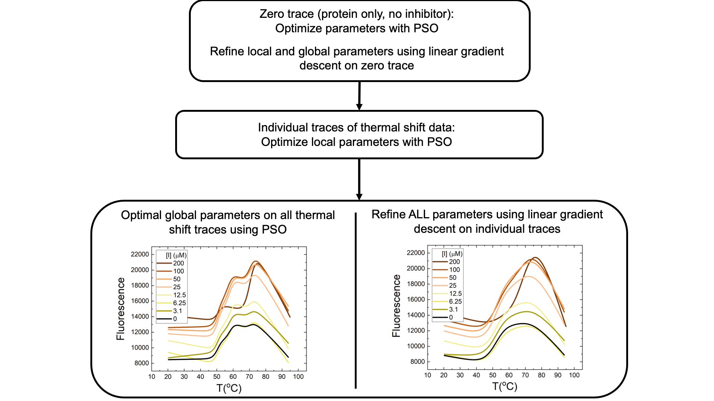
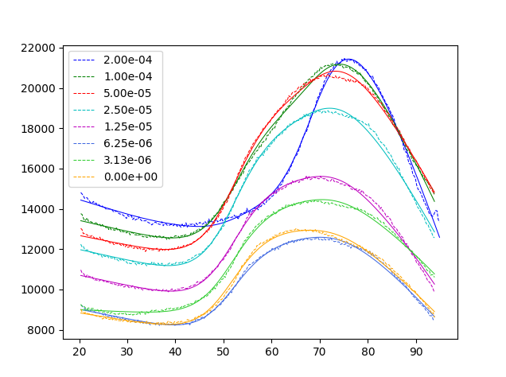

# Application of PSO to enzymatic mechanism

Code to support paper in https://www.cell.com/patterns/

*Application of PSO (Particle Swarm Optimization) to understand the allosteric mechanism of action of inhibition of the enzyme HSD17ß13* 

## Requirements:

- Python 3.9

## Instructions

To perform a single run, install the requirements and run the main `run.py` python file.

```
pip install -r requirements.txt
python run.py
```


### Overview of code

- Fluorescence data for a “zero trace” (i.e., protein alone, no inhibitor) is analysed and parameters are optimized using PSO.
- Linear gradient descent is performed on the “zero trace” following PSO to refine fitting parameters
- PSO is used on the individual traces (i.e., each inhibitor concentration) of thermal shift data to derive local parameters
- Then, optimal global parameters for all traces are determined using PSO and refined using linear gradient descent



### Expected results

You will see the pyswarms output describing the progress of each PSO step. At the end, 2 plots should be produced of the final 2 fitting steps, the latter looking like the plot below:



Note: A perfect fit is not expected to occur every time. For this dataset, it should reach the correct final solution 15% of the time. See below.


### Configuration:

- **Multiple runs**: If you would like to see the performance of the model over a set of runs, increase `NUMBER_OF_RUNS` in `run.py` to e.g. 100.
- **Saving images/files**: If you would like the results of the fits exported to csvs, and the files and plots generated saved to disk, create the export folders `CSV Exports` and `Plots` in the home directory and set `SAVE_TO_DISK` in `run.py` to `True`


